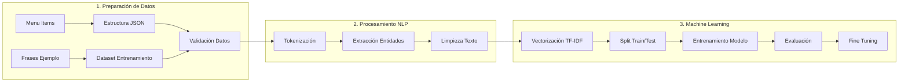

```mermaid
flowchart LR
    subgraph Datos["1. Preparación de Datos"]
        A1[Menu Items] --> B1[Estructura JSON]
        A2[Frases Ejemplo] --> B2[Dataset Entrenamiento]
        B1 --> C1[Validación Datos]
        B2 --> C1
    end

    subgraph NLP["2. Procesamiento NLP"]
        D1[Tokenización] --> E1[Extracción Entidades]
        E1 --> F1[Limpieza Texto]
    end

    subgraph ML["3. Machine Learning"]
        G1[Vectorización TF-IDF] --> H1[Split Train/Test]
        H1 --> I1[Entrenamiento Modelo]
        I1 --> J1[Evaluación]
        J1 --> K1[Fine Tuning]
    end

    C1 --> D1
    F1 --> G1
```