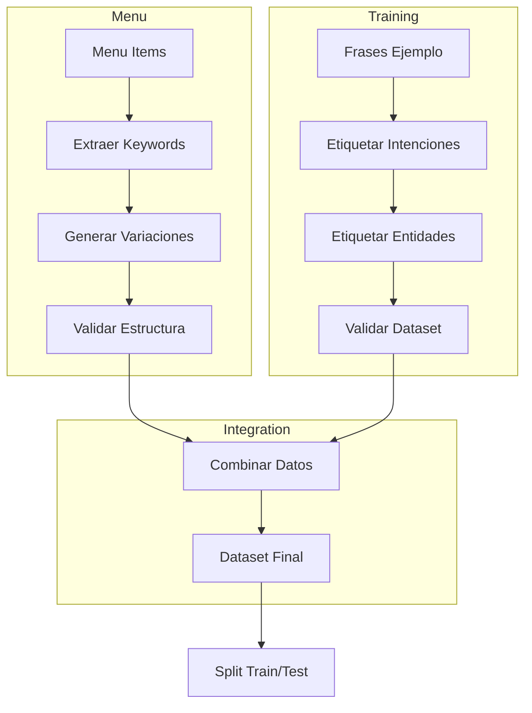

```mermaid
flowchart TB
    subgraph Menu
        A[Menu Items] --> B[Extraer Keywords]
        B --> C[Generar Variaciones]
        C --> D[Validar Estructura]
    end

    subgraph Training
        E[Frases Ejemplo] --> F[Etiquetar Intenciones]
        F --> G[Etiquetar Entidades]
        G --> H[Validar Dataset]
    end

    subgraph Integration
        D --> I[Combinar Datos]
        H --> I
        I --> J[Dataset Final]
    end

    J --> K[Split Train/Test]
```