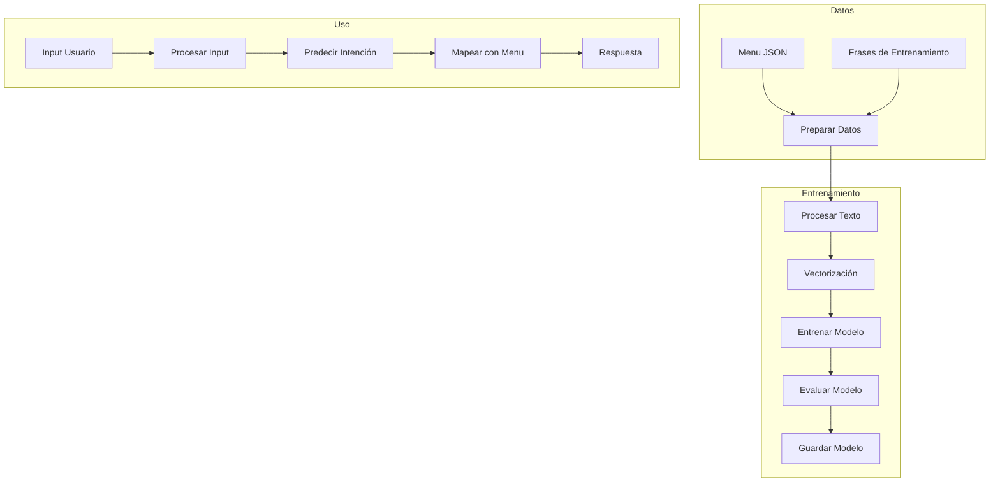

```mermaid
flowchart TB
    subgraph Datos
        A[Menu JSON] --> B[Preparar Datos]
        C[Frases de Entrenamiento] --> B
    end

    subgraph Entrenamiento
        B --> D[Procesar Texto]
        D --> E[Vectorización]
        E --> F[Entrenar Modelo]
        F --> G[Evaluar Modelo]
        G --> H[Guardar Modelo]
    end

    subgraph Uso
        I[Input Usuario] --> J[Procesar Input]
        J --> K[Predecir Intención]
        K --> L[Mapear con Menu]
        L --> M[Respuesta]
    end
```